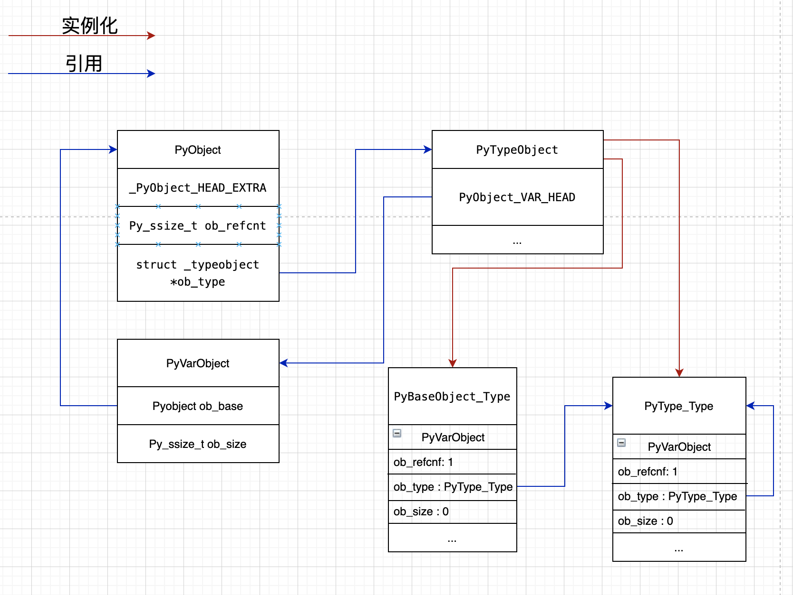

### 前言
教程都说python一切皆对象，但是其中的原理仍然云里雾里的，因此决定刨根问底，直接从源码下手。所有源码分析均基于cpython3.6.13版本

### PyObject(对象的基石)
在`Python`内部，所有对象的结构体都包含`PyObject`，`PyObject`结构体定义在`Include/object.h`中，代码如下：

    typedef struct _object {
        _PyObject_HEAD_EXTRA
        Py_ssize_t ob_refcnt;
        struct _typeobject *ob_type;
    } PyObject;

结构体包含三个字段:
- _PyObject_HEAD_EXTRA：此宏的实现为双链表结构，用于追踪所有的python对象，该宏在Py_DEBUG定义时才会定义，一般不启用
- 引用计数(ob_refcnt)：对象被引用时加1，引用解除时减1，当引用计数为0时，对象回收
- 类型指针(ob_type)：指向对象的类型，类型对象描述实例对象的数据及行为，该类型为`PyTypeObject`，包含了所有对象共有的数据与行为

### PyVarObject(变长对象的基石)
例如`list`等可变对象，自然需要记录元素的个数，`PyVarObject`自然就有必要存在了，代码位置仍然在`Include/object.h`中，代码如下：

    typedef struct {
        PyObject ob_base;
        Py_ssize_t ob_size; /* 记录元素个数 */
    } PyVarObject;

### PyTypeObject(类型的基石)
源代码在`Include/object.h`中，由于代码过长，只截取关键字段，代码如下：

    typedef struct _typeobject {
        PyObject_VAR_HEAD /* 宏定义，代表PyVarObject */
        const char *tp_name; /* 类的名称 */
        Py_ssize_t tp_basicsize, tp_itemsize; /* 创建实例对象时所需内存信息 */

        /* 所有对象包含的标准操作 */

        destructor tp_dealloc;
        printfunc tp_print;
        getattrfunc tp_getattr;  /* 对应魔法方法__getattr__ */
        setattrfunc tp_setattr;
        reprfunc tp_repr;
        ...

        /* 标准类的方法套件 */

        PyNumberMethods *tp_as_number;
        PySequenceMethods *tp_as_sequence;
        PyMappingMethods *tp_as_mapping;
        
        ...

        /* 迭代器相关函数 */
        getiterfunc tp_iter;
        iternextfunc tp_iternext;

        ...
        struct _typeobject *tp_base; /* 基类对象 */
        ...
    } PyTypeObject;

`PyTypeObject`只是类型的结构体定义，在python3中，所有的类型都默认继承至`object`，因此我们找到所有类型的基类`PyBaseObject_Type`。

### PyBaseObject_Type(类型之基)
`PyBaseObject_Type`的实现在`Objects/typeobject.c`中，关键代码如下：

    PyTypeObject PyBaseObject_Type = {
        PyVarObject_HEAD_INIT(&PyType_Type, 0)
        "object", /* 类名称 */
        sizeof(PyObject), /* tp_basicsize */
        0, /* tp_itemsize */
        object_dealloc, /* tp_dealloc */
        ...
        0,            / * tp_base */
        object_repr, /* tp_repr */
    };

`PyVarObject_HEAD_INIT`此宏生成`PyVarObject`类型的实例，代码如下：

    #define PyObject_HEAD_INIT(type)        \
        { _PyObject_EXTRA_INIT              \
        1, type },

    #define PyVarObject_HEAD_INIT(type, size)       \
        { PyObject_HEAD_INIT(type) size },
根据`PyBaseObject_Type`的结构可以看出tp_base为0，因此`object`为类型继承链的终点，并且`PyBaseObject_Type`的类型为`PyType_Type`，这里我们引出了一个重要的类型`PyType_Type`。

### PyType_Type(类型的类型)
直接找到源码`Objects/typeobject.c`，代码如下：

    PyTypeObject PyType_Type = {
        PyVarObject_HEAD_INIT(&PyType_Type, 0)
        "type", /* tp_name */
        sizeof(PyHeapTypeObject), /* tp_basicsize */
        sizeof(PyMemberDef), /* tp_itemsize */
        (destructor)type_dealloc, /* tp_dealloc */
        // ...
        (reprfunc)type_repr, /* tp_repr */
        // ...
    };
内建类型和⾃定义类对应的`PyTypeObject`对象都是这个通过`PyType_Type`创建的。`PyType_Type` 在 Python 的类型机制中是⼀个⾄关重要的对象，它是所有类型的类型，称为元类型(meta class)。 借助元类型，你可以实现很多神奇的⾼级操作，也就是我们常说的`元编程`。

`PyType_Type`将⾃⼰的 ob_type 字段设置成它⾃⼰。这跟我们在 Python 中看到的⾏为是吻合的：

    >>> type.__class__
    <class 'type'>
    >>> type.__class__ is type
    True

### 对象关系图

### 总结
现在我们可以看出所有对象中都包含了`PyObject`结构基础部分，每个python对象都会被强制转换为`PyObject`指针，这就是一切皆对象的核心原因，然后根据`ob_type`做不同的处理。