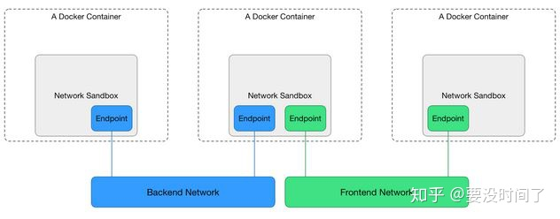
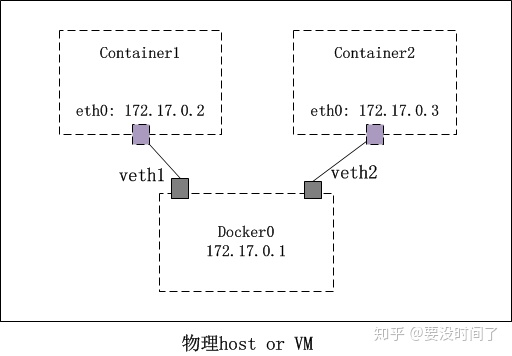

## 1.什么是Linux Namespace

简单来说，Linux Namespace 是操作系统内核在不同进程间实现的一种【环境隔离机制】。

举例来说：现在有两个进程A、B。他们处于两个不同的PID Namespace下：ns1, ns2。在ns1下，A进程的PID可以设置为1，在ns2下，B进程的PID也可以设置为1。但是它们两个并不会冲突，因此Linux PID Namespace对PID这个资源在进程A，B之间做了隔离。A进程在ns1下是不知道B进程在ns2下面的PID的。

这种环境隔离机制是实现容器技术的基础。因为在整个操作系统的视角下，一个容器表现出来的就是一个进程。

Linux一共构建了8种不同的Namespace，用于不同场景下的隔离：
- cgroup：该namespace可单独管理自己的cgroup
- ipc：该namespace有自己的IPC，比如共享内存、信号量等
- mount namespace：该namespace有自己的挂载信息，即拥有独立的目录层次
- network namespace：该namespace有自己的网络资源，包括网络协议栈、网络设备、路由表、防火墙、端口等
- user namespace：该namespace有自己的用户权限管理机制(比如独立的UID/GID)，使得namespace更安全
- uts namespace：该namepsace有自己的主机信息，包括主机名(hostname)、NIS domain name
- pid namespace：该namespace有自己的进程号，使得namespace中的进程PID单独编号，比如可以PID=1
- time namespace：该namespace有自己的启动时间点信息和单调时间，比如可设置某个namespace的开机时间点为1年前启动，再比如不同的namespace创建后可能流逝的时间不一样

用户可以同时创建具有多种资源类型的namespace，比如创建一个同时具有uts、pid和user的namespace。

## 2.Docker的网络隔离机制
Docker使用的网络模型是CNM（Container Network Model），根据官方的设计文档，它的结构大致如下：

CNM模型一共需要三个组件：
 - NetworkSandbox：在docker中实现对应为Linux Network Namespace
 - Endpoint：在docker中实现对应VETH（虚拟网卡设置）
 - Network：在docker中的实现对应Linux Bridge

## 3.什么是VETH、Linux Bridge、Linux Network Namspace

Linux Bridge是Linux提供的一种虚拟网络设备，它可以实现多个不同容器在一个以太网内进行通信。

Bridge默认情况下工作在二层网络，可以在同一网络根据一定的规则过滤和转发以太网包。若给一个Bridge设备分配一个IP地址，就会开启它的三层工作模式。

若你在一台安装了 docker 的 Linux 主机上执行 ip addr命令，就可以看到一个名为 docker0的Linux Bridge。默认情况下在这台宿主机上启动的容器都会链接到这个 Bridge 上。因为是在同一个网络下，且通过 Bridge 链接在一起，所以不同的容器之间可以进行网络通信。否则，不同的容器之间会因为链接的 Bridge 不同而产生网络隔离。

VETH也是Linux提供的一种网络设备，它在行为上类似操作系统的Pipe。因为VTH总是成对出现，一端为输入端，一端为输出端。每一个VETH设备都可以被赋予一个IP地址，然后参与三层网络通信的过程。

Linux Network Namespace 是 Linux 提供的在不同进程之间的一种网络环境隔离机制。这里可以简单的理解为，每一个进程在自己的 NS 下，都独享了一套完整的网络环境（与宿主机对比）。特定 NS 内的网络环境对外部来说是不可见的，并且在其中对一些网络设置做修改也不会影响到外部（如路由规则）。

若只考虑两个容器在宿主机上面的网络模型，它的结构如下所示：

## 4.Docker 的 Hostname 隔离机制——Linux UTS Namespace
简单来说，这是 Linux 提供的一种针对多个进程间的 Hostname 的隔离机制。它允许一个进程在其内部设置自己的 hostname。

## 5.Docker 的 IPC 隔离机制——Linux IPC Namespace
Linux 在实现进程间通信时用了以下几种方法：
- 管道
- 共享内存
- 信号量
- 消息队列

这些结构在被创建出来的时候，都会在全局范围内有一个唯一的 ID。所以，如果想要在单独的进程空间中，有一套自己的 IPC 标识并且对宿主机环境屏蔽，这就是 Linux 的 IPC 隔离机制。 IPC Namespace 的实现其实和 UTS 是差不多的：在创建进程的时候加入CLONE_NEWIPC标志即可。

当子进程和父进程都被创建之后，在子进程中通过ipcmk -Q命令创建的消息队列不会在宿主机上被发现，而在宿主机上创建的也不会被子进程发现。

## 6.Docker 的 Mount 隔离机制——Linux Mount Namespace
Linux Mount Namespace 实现了在不同进程间对于文件系统「挂载点」的隔离机制。每一个进程所持有的挂载点信息都 可以在 /proc/mounts 和 /proc/mountinfo 和 /proc/mountstats 中找到。/proc 是 Linux 提供的一种虚拟文件系统。此目录下保存的文件和目录信息描述了该操作系统一些运行时的信息。我们既可以通过改变目录下的一些内容来影响操作系统运行的结果，也可以查询该目录下的信息以便获得当前操作系统的运行情况。/proc 目录下的东西并不是真的文件和目录，它实际上是存在于内存中的。

如果想开启这种隔离机制，需要在创建子进程的时候使用CLONE_NEWNS参数。默认情况下，子进程的挂载点信息一般都是从父进程的 mount namespace 下拷贝的。但是在子进程创建完成之后，两者之间的 mount namespace 以及相应的挂载点信息就没有任何关系了。在子进程中对挂载点信息的操作是不会影响到父进程的。

Linux Mount Namespace 提供的仅仅是对「挂载点」的隔离，并不是对文件系统的隔离。事实上，即使是在已经建立了Mount Namespace 隔离的两个进程中执行 mount/umount 操作也同样会影响到宿主机的文件系统。

## 7.Docker 的 PID 隔离机制——Linux PID Namespace

在众多 Linux 中的进程中，有一个进程是比较特殊的：init 进程（PID 为1）。它是操作系统内核初始化后第一个启动的进程，也是整个操作系统范围内的父进程，即祖先进程。之后所有的进程都是从它派生而来。最终形成一个具有层级结构的进程树。Init 进程有很多特殊的权限，如屏蔽一些信号或检查它派生的进程的状态。Init 进程在检查到一些孤儿进程的时候，会对他们进行回收。

如果能做到 PID 在容器内外部也是隔离的，那么在容器内部看起来进程就好像运行在了一个单独的操作系统中。特定容器内部或者说特定进程空间下的 PID 是可以和宿主机的 PID 取值相同的，并且不会发生冲突。以此类推，若进程和容器内部也有一个PID 为1的进程，它将会独立的管理其创建出的子进程。而这些特性，也正是 Linux PID Namespace 实现 PID 隔离所需要的。

## 8.Docker 的 User 隔离机制——Linux User Namespace
Linux User Namespace 提供的隔离机制允许多个不同的进程间各有自己独立的一套 UID/GID 体系，并且可以将进程内部的 UID/GID 与宿主机的 UID/GID 进行映射。开启这个隔离机制的方法也很简单：在创建子进程的时候传入CLONE_NEWUSER参数即可。至于 UID/GID 的映射，可以在/proc/<pid>/uid_map 和 /proc/<pid>/gid_map 两个文件中，按照 ID-inside-ns ID-outside-ns length的形式写入映射记录。

这里有一个实现进程间「安全机制」的 Case，是通过 Linux User Namespace 来实现的:

在创建子进程的时候，父进程通过对/proc/<子进程pid>/uid_map 和 /proc/<子进程pid>/gid_map 两个文件的写入，将子进程的PID 映射为子进程内部值为0的 uid 和 gid。子进程启动的时候，会因为我们设置了 uid 为0，从而自动切换到 root 用户。这样一来，我们就实现了使用一般用户创建子进程，但是在子进程的内部确是以 root 用户的身份来运行的效果。
