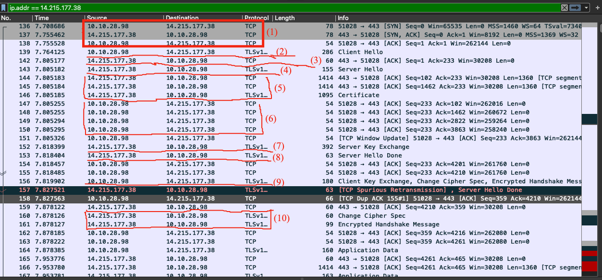
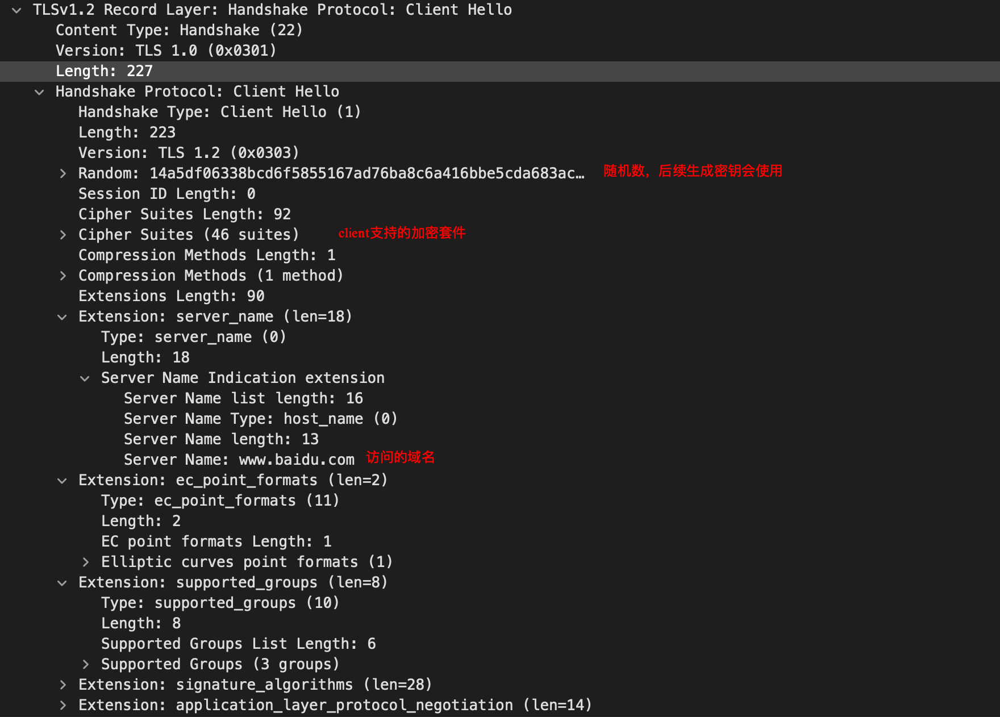
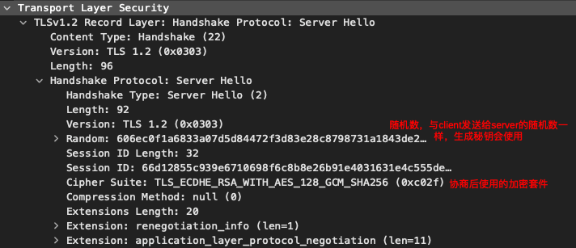
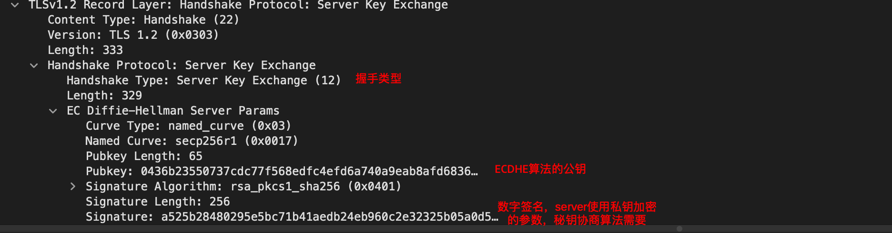
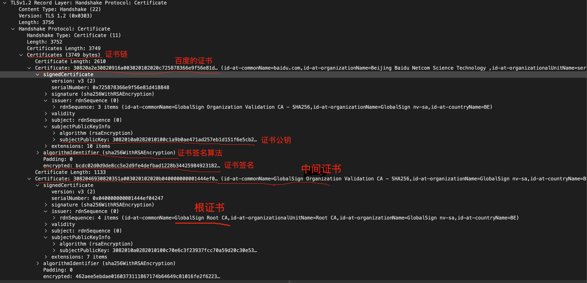
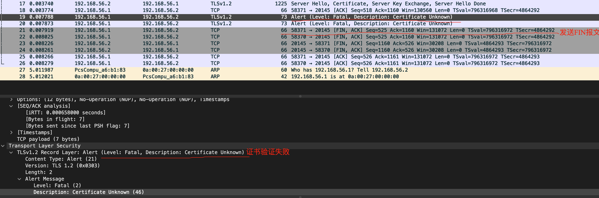

### 前言

来自面试官的灵魂拷问：为什么需要使用https，与http有何不同？

想必不少童鞋会回答：https比http安全！

那么接下来便是面试官的夺命连环问：
  - 为什么https比http安全，依据是什么？
  - TLS报文交互的流程是什么？
  - 证书验证的逻辑是什么？

下面就一一解答上述问题，由于本文的重点在于证书验证，因此对秘钥交换感兴趣的小伙伴可以文末的参考链接。

### 为什么https比http安全，依据是什么？
根据数字证书（类似于身份证）校验服务器是服务器。这就比如证明`我是我，你是你`，这个时候就需要国家（权威机构）签发的身份证来校验。

### TLS报文交互的流程是什么？
我们通过Wireshark抓包来观察`curl www.baidu.com`的过程中，都有哪些数据包的交互。

- （1）首先是老生常谈的TCP3次握手，
- （2）成功建立连接之后client发送Client Hello报文
    
    
- （3）client收到server发送的ACK报文，确认服务端收到了Client Hello报文
    - 为什么服务端不直接发送Server Hello报文？
      - 由于Server hello 要根据client的加密套件、公钥继续算出自己的公钥和私钥，这个计算过程可能会耗时较长。如果server不马上回复ACK，可能导致client认为server已经超时。
- （4）server发送Server Hello报文
    
    
- （5）server下发证书，分成3个报文发送
- （6）client发送4个ACK确认报文，分别确认Server Hello报文，server证书的3个报文。
- （7）server发送Server Key Exchange
  
    
- （8）server发送Server Hello Done
  
    告诉client自己的消息结束了，client开始校验证书。
- （9）client发送Client Key Exchange、Change Cipher Spec、Encrypted Handshake Message
     
     - Client Key Exchange：与Server Key Exchange类似，用于秘钥协商
     - Change Cipher Spec：通知接收方更改密码规范，即以后的消息开始加密传输。
     - Encrypted Handshake Message：使用对称秘钥进行加密的第一个报文，校验秘钥是否正确。
- （10）server发送Change Cipher Spec、Encrypted Handshake Message，原理与client一致。

    至此，秘钥交换完成，之后就会通过秘钥加密发送数据。

### 证书验证的逻辑是什么？
证书验证逻辑是在client收到Server Hello Done报文之后，证书报文格式如下：

- 由上图可知，证书是一个证书链，服务端的证书会在第一级，根证书在最后一级。在验证证书时会从第一级证书开始往下查找，当查找到浏览器包含此机构的证书时开始进行证书验证。若查找完后都会发现可信任的证书，浏览器则会提示此站点不可信任。
  
- 由于百度的证书在我的浏览器中并未内置，因此百度的证书不可信任，接着逐级查找，找到根证书时，在浏览器内置证书中找到了此机构`GlobalSign nv-sa`，证书如下:
 
  

- 验证根证书

    通过浏览器内置证书可以看到证书公钥大整数：

        DA0EE6998DCEA3E34F8A7EFBF18B83256BEA481FF12AB0B9951104BDF063D1E26766CF1CDDCF1B482BEE8D898E9AAF298065ABE9C72D12CBAB1C4C7007A13D0A30CD158D4FF8DDD48C50151CEF50EEC42EF7FCE952F2917DE06DD535308E5E4373F241E9D56AE3B2893A5639386F063C88695B2A4DC5A754B86C89CC9BF93CCAE5FD89F5123C927896D6DC746E934461D18DC746B2750E86E8198AD56D6CD5781695A2E9C80A38EBF224134F73549313853A1BBC1E34B58B058CB9778BB1DB1F2091AB09536E90CE7B3774B97047912251631679AEB1AE412608C8192BD146AA48D6642AD78334FF2C2AC16C19434A0785E7D37CF62168EFEAF2529F7F9390CF
  
    证书公钥幂指数为`65537`
  
    报文中显示证书签名：

        462aee5ebdae0160373111867174b64649c81016fe2f622317ab1f87f882edcadf0e2cdf64758ee51872a78c3a8bc9aca57750f7ef9ea4e0a08f1457a32a5fec7e6d10e6ba8db00887760e4cb2d951bb1102f25cdd1cbdf355960fd406c0fce2238a2470d3bbf0791aa76170838aaf06c520d8a163d06cae4f32d7ae7c184575052977df4240646486be2a7609316f1d24f499d085fef22108f9c6f6f1d059edd6563c08280367baf0f9f1901647ae67e6bc8048e9427634975569240e83d6a02db4f5f3798a4928741a41a1c2d324883530609417b4e10422313d3b2f1706b2b89d862b5a69ef83f54bc4aab42af87ca1b185948cf40c870cf4ac40f8594998
    
    计算过程如下图：
    
    
    
    导出报文中signedCertificate，如下图：

    

    通过openssl计算它的哈希值:
        
        openssl dgst -sha256 ~/github/pyj_blog/network/application/tls/2.bin

        SHA256(/Users/pengyejun/github/pyj_blog/network/application/tls/2.bin)= b3695f1804023eb5740cf42a3a43dc8b425e8b41a130afe77be407c0f6df9f8a
    
    经过对比，两个值相等，则确定此证书可信任。

- 验证百度站点证书
    
    验证逻辑与根证书验证一致，不同的点在于，证书公钥取根证书中的`subjectPublicKey`，如下所示：

    

    获取了证书公钥之后就可以根据根证书验证方法进行验证。

    

### 完结
  以上就是证书验证以及tls握手的流程，对于秘钥交换感兴趣的小伙伴可以阅读下方参考链接

### 延伸阅读

  - 浏览器提示我证书不可用，我敲了`this is unsafe`之后发生了什么？
    
    当证书验证失败时，浏览器会给服务端发送一个证书验证失败的报文，并且主动发送FIN报文断开此条tcp连接，报文如下图所示：

    

    当我们输入`this is unsafe`之后，浏览器会重新发起tcp连接，建立连接之后直接跳过证书验证，开始进行秘钥交换。此后数据仍然是加密的，使用抓包工具抓取的包仍然不是明文，只是此证书对我们当前的浏览器来说是未被信任的，可能会存在中间人攻击。

### 参考链接

- [Client Hello](https://laoqingcai.com/tls1.2-clienthello/)
- [Server Hello](https://laoqingcai.com/tls1.2-serverhello/)
- [Client Key Exchange](https://laoqingcai.com/tls1.2-clientkeyexchange/)
- [Server Key Exchange](https://laoqingcai.com/tls1.2-serverkeyexchange/)
- [Server Certificate](https://laoqingcai.com/tls1.2-certificate/)
- [Change Cipher Spec(Client)](https://laoqingcai.com/tls1.2-changecipherspec-c/)
- [Change Cipher Spec(Server)](https://laoqingcai.com/tls1.2-changecipherspec-s/)
- [HandShake Protocol](https://laoqingcai.com/tls1.2-handshake/)
- [再谈HTTPS](https://zhuanlan.zhihu.com/p/75461564)
- [HTTPS 精读之 TLS 证书校验](https://zhuanlan.zhihu.com/p/30655259)
