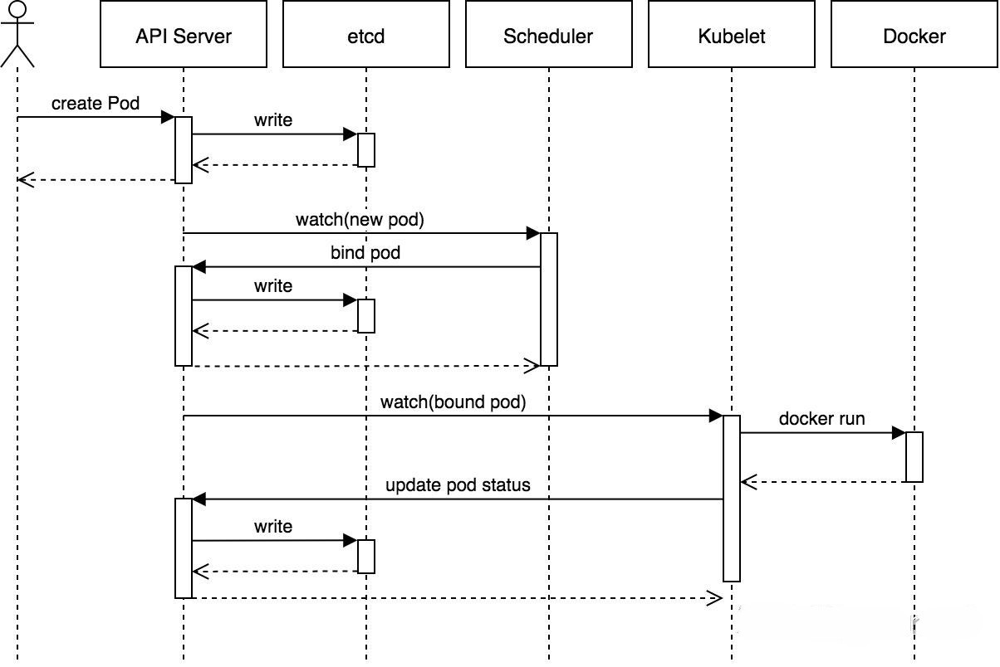

## kubelet
简介：kubelet 是在每个Node节点上运行的主要“节点代理”。它可以使用以下之一向apiserver注册：主机名(hostname)；覆盖主机名的参数；某云驱动的特定逻辑。

kubelet是基于PodSpec来工作的。每个PodSpec是一个描述Pod的YAML或JSON对象。kubelet接受通过各种机制（主要是通过apiserver）提供的一组PodSpec，并确保这些PodSpec中描述的容器处于运行状态且运行状况良好。kubelet不管理不是由kubernetes创建的容器。

## kube-apiserver
简介：Kubernetes API 服务器验证并配置 API 对象的数据， 这些对象包括 pods、services、replicationcontrollers 等。 API 服务器为 REST 操作提供服务，并为集群的共享状态提供前端， 所有其他组件都通过该前端进行交互。

## kube-controller-manager
简介：Kubernetes 控制器管理器是一个守护进程，内嵌随 Kubernetes 一起发布的核心控制回路。每个控制器是一个控制回路，通过 API 服务器监视集群的共享状态， 并尝试进行更改以将当前状态转为期望状态。 目前，Kubernetes 自带的控制器例子包括副本控制器、节点控制器、命名空间控制器和服务账号控制器等。

## kube-proxy
简介：Kubernetes 网络代理在每个节点上运行。网络代理反映了每个节点上 Kubernetes API 中定义的服务，并且可以执行简单的 TCP、UDP 和 SCTP 流转发，或者在一组后端进行 循环 TCP、UDP 和 SCTP 转发。 当前可通过 Docker-links-compatible 环境变量找到服务集群 IP 和端口， 这些环境变量指定了服务代理打开的端口。 有一个可选的插件，可以为这些集群 IP 提供集群 DNS。 用户必须使用 apiserver API 创建服务才能配置代理。

## kube-scheduler
简介：Kubernetes 调度器是一个控制面进程，负责将 Pods 指派到节点上。 调度器基于约束和可用资源为调度队列中每个 Pod 确定其可合法放置的节点。 调度器之后对所有合法的节点进行排序，将 Pod 绑定到一个合适的节点。 在同一个集群中可以使用多个不同的调度器；kube-scheduler 是其参考实现。 参阅调度 以获得关于调度和 kube-scheduler 组件的更多信息。

## etcd
简介：支持一致性和高可用的名值对存储组件，Kubernetes集群的所有配置信息都存储在 etcd 中。请确保您备份了etcd 的数据。关于 etcd 的更多信息，可参考[etcd官方文档](https://etcd.io/docs/)

## 架构图

## 创建Pod流程

## 参考链接
[k8s service 负载均衡：proxy mode介绍](https://www.modb.pro/db/29601)