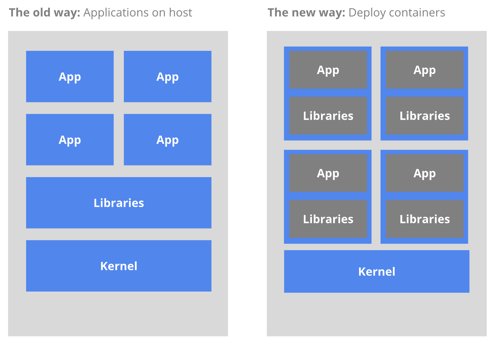

## 1.为什么需要使用容器？

**众所周知：环境问题是最复杂的问题🙃**

- 传统部署：传统的应用部署方式是通过插件或脚本来安装应用。这样做的缺点显而易见，所有服务都与当前操作系统绑定，服务上线对开发与部署人员都十分痛苦，因此大部分应用都选择用虚拟机发布，但不利于服务移植与管理，并且资源利用率低。

- 容器部署：每个容器之间互相隔离，每个容器有自己的文件系统，容器之间进程不会互相影响，能区分计算资源。相对于虚拟机，容器能快速部署，由于容器与底层设施、宿主机的文件系统是解耦的，所以它能在不同云环境、不同操作系统之间迁移。

**容器的优势总结:**
- 快速创建/部署应用：与虚拟机相比，容器镜像的创建更加容易。
- 持续开发、集成和部署：提供可靠且频繁的容器镜像构建/部署，回滚快速简单(由于镜像不可变性)
- 开发与运行想分离

## 2.Kubernetes是什么？
Kubernetes是容器集群管理系统，是一个开源的平台，可以实现容器集群的自动化部署、自动扩缩容、维护等功能。
  

### 2.1 Kubernetes 特点
- 可移植：支持公有云，私有云，混合云，多重云
- 可扩展：模块化，插件化，可挂载，可组合
- 自动化：自动部署，自动重启，自动复制，自动扩缩