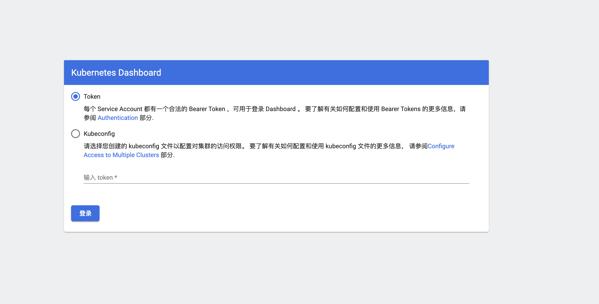

## 1.环境准备
  我使用的环境是：3台[ubuntu20.04](http://mirrors.ustc.edu.cn/ubuntu-releases/20.04/)虚拟机。ubuntu1作为master节点，配置2核2G内存，ubuntu2与ubuntu3作为node节点，要求3台机器可以互相ping通，并且配置了[ssh免密登录](https://blog.csdn.net/universe_hao/article/details/52296811)。

 ## 2.关闭swap
   k8s要求linux关闭swap功能，打开/etc/fstab文件，注释最后一行。
   
   然后重启系统

## 3.修改主机hostname
  在ubuntu1机器上执行`sudo hostnamectl set-hostname master1`
  在ubuntu2机器上执行`sudo hostnamectl set-hostname node1`
  在ubuntu3机器上执行`sudo hostnamectl set-hostname node2`

## 4.安装docker
  `master1、node1、node2节点均需要安装`

  一键添加docker源并安装docker
    
    sudo apt-get update
    sudo apt-get install -y apt-transport-https ca-certificates
    curl -fsSL https://download.docker.com/linux/ubuntu/gpg | sudo apt-key add -
    sudo add-apt-repository "deb [arch=amd64] https://download.docker.com/linux/ubuntu $(lsb_release -cs) stable"
    sudo apt-get update
    sudo apt install -y docker-ce=5:19.03.9~3-0~ubuntu-focal 
  可以将上述代码段复制到shell脚本中，一把梭执行。安装完成后可以执行`sudo docker version`查看是否安装成功。

## 5.安装Kubernetes(基于v1.20.5版本)
  `master1、node1、node2节点均需要安装`

  一键添加k8s源并安装[kubelet，kubeadm，kubectl](https://blog.csdn.net/weixin_42072280/article/details/112348857)

    sudo curl -s https://mirrors.aliyun.com/kubernetes/apt/doc/apt-key.gpg | sudo apt-key add -
    sudo apt-get update
    cat <<EOF >/etc/apt/sources.list.d/kubernetes.list
    deb https://mirrors.aliyun.com/kubernetes/apt/ kubernetes-xenial main
    EOF
    sudo apt-get install -y kubelet=v1.20.5 kubeadm=v1.20.5 kubectl=v1.20.5
  同理可以把代码复制到shell脚本中,一把梭哈执行。
  安装完成后可通过`sudo kubeadm version`查看是否安装成功。

## 6.手动拉取依赖的镜像
  `master1、node1、node2节点均需要安装`

  由于拉取官方k8s镜像需要科学上网，因此可以使用国内镜像源

    images=(kube-apiserver:v1.20.5 kube-controller-manager:v1.20.5 kube-scheduler:v1.20.5 kube-proxy:v1.20.5 pause:3.2 etcd:3.4.13-0 coredns:1.7.0)

    for imageName in ${images[@]} ; do
        newimageName=${imageName}
        sudo docker pull registry.cn-hangzhou.aliyuncs.com/google_containers/$imageName
        sudo docker tag registry.cn-hangzhou.aliyuncs.com/google_containers/$imageName k8s.gcr.io/$newimageName
        sudo docker rmi registry.cn-hangzhou.aliyuncs.com/google_containers/$imageName
    done

    # 网络插件镜像
    sudo docker pull quay.io/coreos/flannel:v0.13.1-rc2

  可以将上述代码段复制到shell脚本中执行，执行脚本前需要先执行`kubeadm config images list`查看依赖的镜像版本，确认脚本中的镜像版本号是否需要更改。

## 7.初始化集群
  命令如下：
    
    sudo kubeadm init --apiserver-advertise-address=10.10.121.122 --pod-network-cidr=10.244.0.0/16

  * --apiserver-advertise-address 指定了 master1 的 ip 地址，不同环境对应的值不同。
  * --pod-network-cidr 用于 k8s 中的 pod 通信，如果你不懂什么意思，就跟着我设相同的值。

  初始化成功之后：

    Your Kubernetes control-plane has initialized successfully!

    To start using your cluster, you need to run the following as a regular user:

      mkdir -p $HOME/.kube
      sudo cp -i /etc/kubernetes/admin.conf $HOME/.kube/config
      sudo chown $(id -u):$(id -g) $HOME/.kube/config

    Alternatively, if you are the root user, you can run:

      export KUBECONFIG=/etc/kubernetes/admin.conf

    You should now deploy a pod network to the cluster.
    Run "kubectl apply -f [podnetwork].yaml" with one of the options listed at:
    https://kubernetes.io/docs/concepts/cluster-administration/addons/

    Then you can join any number of worker nodes by running the following on each as root:

    kubeadm join 10.10.121.122:6443 --token t9pzpw.pr4vinaqo7gm4qu6 \
        --discovery-token-ca-cert-hash sha256:f9abc3d9e696ead95d4a8bacc11ce37657fcd713a3d2e04288297c7709d1d2c0

  这段输出有两个重点，`第一个是 To start using your cluster`，因为我是普通用户，选择第一种方式，操作如下：
    
    mkdir -p $HOME/.kube
    sudo cp -i /etc/kubernetes/admin.conf $HOME/.kube/config
    sudo chown $(id -u):$(id -g) $HOME/.kube/config

  操作成功之后使用`kubectl get nodes`能看下输出：

    NAME      STATUS     ROLES                  AGE     VERSION
    master1   NotReady   control-plane,master   3h31m   v1.20.5
  
  第二个重点是：
    
    kubeadm join 10.10.121.122:6443 --token t9pzpw.pr4vinaqo7gm4qu6 \
        --discovery-token-ca-cert-hash sha256:f9abc3d9e696ead95d4a8bacc11ce37657fcd713a3d2e04288297c7709d1d2c0
        
  记住加入集群的命令，后续会使用。

## 8.安装网络插件
  执行以下命令，安装网络插件Flannel。
  
    sudo kubectl apply -f https://raw.githubusercontent.com/coreos/flannel/master/Documentation/kube-flannel.yml
  
  如果不安装Flannel，我们刚刚init好的master节点会处于NOT_READY状态。安装好之后，可以通用命令`kubectl get nodes`查看节点状态。

## 9.Slave节点加入集群
  在node1，node2节点上执行：

    kubeadm join 10.10.121.122:6443 --token t9pzpw.pr4vinaqo7gm4qu6 \
        --discovery-token-ca-cert-hash sha256:f9abc3d9e696ead95d4a8bacc11ce37657fcd713a3d2e04288297c7709d1d2c0
  
  执行成功后，在master1节点上使用命令`kubectl get nodes`，不出意外的话就会有如下输出：

    NAME      STATUS   ROLES                  AGE     VERSION
    master1   Ready    control-plane,master   4h3m    v1.20.5
    slave1    Ready    <none>                 22s     v1.20.5
    slave2    Ready    <none>                 6m26s   v1.20.5

## 10.安装dashboard
  在master1节点上安装kubernetesui镜像，命令如下：

    sudo docker pull kubernetesui/dashboard:v2.2.0
    sudo docker pull kubernetesui/metrics-scraper:v1.0.6

  复制[dashboard.yaml](https://github.com/pengyejun/pyj_blog/blob/master/ops/k8s/deploy/dashboard.yaml)文件内容，在master节点上执行`kubectl apply -f dashboard.yaml`。

### 10.1 创建用户与角色
  k8s 的风格就是 “用 yaml 说话”。所以我们需要编写 user.yaml，用来创建用户；编写 role.yaml，用来给用户赋予角色。
  
  user.yaml：
    
    apiVersion: v1
    kind: ServiceAccount
    metadata:
      name: admin  # 注意用户名
      namespace: kube-system

  role.yaml：

    kind: ClusterRoleBinding
    apiVersion: rbac.authorization.k8s.io/v1
    metadata:
      name: dashboard:admin
    roleRef:
      apiGroup: rbac.authorization.k8s.io
      kind: ClusterRole
      name: cluster-admin
    subjects:
    - kind: ServiceAccount
      name: admin
      namespace: kube-system
    
  在master1节点上执行命令：

    kubectl create -f user.yaml
    kubectl create -f role.yaml

### 10.2 访问dashboard
  直接通过访问`https://10.10.121.122:6443/api/v1/namespaces/kubernetes-dashboard/services/https:kubernetes-dashboard:/proxy/#/login`可以看到如下输出：

    {
      "kind": "Status",
      "apiVersion": "v1",
      "metadata": {
    
      },
      "status": "Failure",
      "message": "services \"https:kubernetes-dashboard:\" is forbidden: User \"system:anonymous\" cannot get resource \"services/proxy\" in API group \"\" in the namespace \"kubernetes-dashboard\"",
      "reason": "Forbidden",
      "details": {
        "name": "https:kubernetes-dashboard:",
        "kind": "services"
      },
      "code": 403
    }
  报错403，说明有权限问题，这是因为最新版的k8s默认启用了[RBAC](https://zhuanlan.zhihu.com/p/63769951)，并为未认证用户赋予了一个默认的身份：`anonymous`。

  对于API Server来说，它是使用证书进行认证的，而我们浏览器上没有这个证书，所以我们要为浏览器配置https证书。

  创建证书：
  - 生成client-certificate-data

    grep 'client-certificate-data' ~/.kube/config | head -n 1 | awk '{print $2}' | base64 -d >> kubecfg.crt

  - 生成client-key-data

    grep 'client-key-data' ~/.kube/config | head -n 1 | awk '{print $2}' | base64 -d >> kubecfg.key

  - 生成证书

    openssl pkcs12 -export -clcerts -inkey kubecfg.key -in kubecfg.crt -out kubecfg.p12 -name "kubernetes-client"

    按要求输入密码直接回车即可，密码不要胡乱输，后面给浏览器导入的时候要用。
    运行完后在当前目录会有个kubecfg.p12证书文件。

  - 在浏览器中导入证书

    点击浏览器 菜单-设置-高级-管理证书

    选择“受信任的根证书颁发机构”这一栏，然后点击导入kubecfg.p12。
    然后根据步骤操作完。

  导入完成后访问：`https://10.10.121.122:6443/api/v1/namespaces/kubernetes-dashboard/services/https:kubernetes-dashboard:/proxy/#/login`，得到一个如下登陆页面：

  

### 10.3 获取token

  我之前获取的用户是`admin`，因此执行以下命令：

    kubectl -n kube-system get secret | grep admin
    # 得到NAME：admin-token-7lfdq
    kubectl -n kube-system describe secret/admin-token-7lfdq
    # 得到token

## 11.完结撒花
  至此，kubernetes集群部署完成，后续对kubernetes的使用就参考官方文档慢慢摸索了~

  特别鸣谢：[零基础手动搭建 k8s 那点事](https://youguanxinqing.xyz/archives/153/)