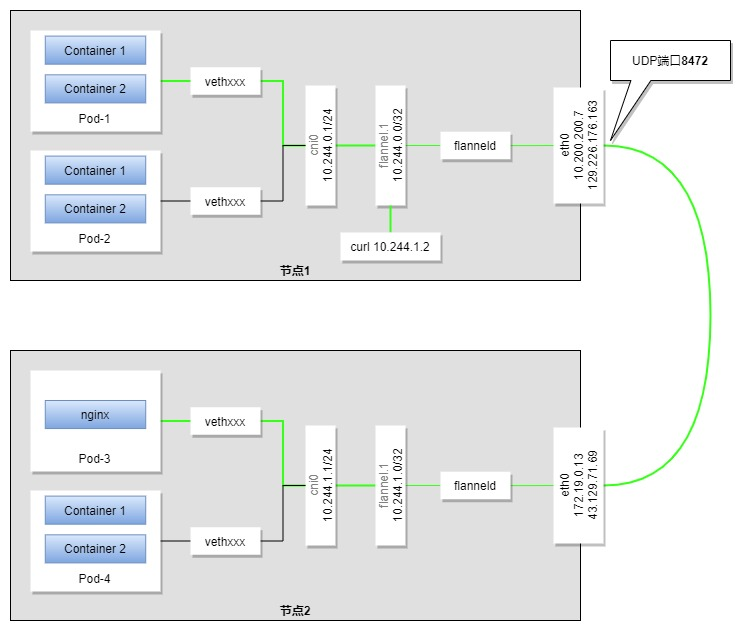

## 1.了解Pod
  Pod是Kubernetes创建或部署的最小单位，一个Pod代表集群上正在运行的一个“进程”。
  
  一个Pod封装一个应用容器（也可以有多个容器），存储资源、一个独立的网络IP以及管理控制容器运行方式的策略选项。Pod代表部署的一个单位：Kubernetes中单个应用的实例，它可能由单个容器或多个容器共享组成的资源。

  在kubernetes集群中Pod有如下两种使用方式：
  - 一个Pod运行一个容器。“每个Pod中一个容器”的模式时最常见的用法；在这种使用方式中，你可以把Pod想象成是单个容器的封装，kubernetes管理的是Pod而不是直接管理容器。
  - 在一个Pod同时运行多个容器。一个Pod中可以同时封装几个需要紧密耦合互相协作的容器，它们之间共享资源。这些在同一个Pod中的容器可以互相写作成为一个service单位--一个容器共享文件，另一个sidecar容器来更新这些文件。Pod将这些容器的存储资源作为一个字体来管理。
  
  每个Pod都是应用的一个实例。如果你想平行扩展应用的话（运行多个实例），你应该运行多个Pod，每个Pod都是一个应用实例。在Kubernetes中，这通常被称为replication。Kubernetes 中 Controller（控制器）负责为应用程序创建和管理这些复制的副本。

## 2.Pod如何管理多个容器
  Pod的设计目的是用来支持多个互相协同的容器，他们形成一个有意义的服务单元。一个Pod中的多个容器很自然就可以随Pod被一起调度到集群中的节点(物理机或者虚拟机)上。Pod中的容器可以:
  - 共享资源、依赖
  - 互相通信
  - 互相协商何时以何种方式结束运行
  
  将多个容器运行于同一个容器组中是一种相对高级复杂的使用方式。只有在容器互相之间紧密耦合时，才应该使用这种方式。例如：Pod中一个容器是web server，用来将共享数据卷中的文件作为网站发布出去，同时另一个容器从远程抓取并更新这些文件。如下图：
    

  某些 Pod 除了使用 app container （工作容器）以外，还会使用 init container （初始化容器），初始化容器运行并结束后，工作容器才开始启动。

  Pod 为其成员容器提供了两种类型的共享资源：
  - 网络
    
    每一个 Pod 被分配一个独立的 IP 地址。Pod 中的所有容器共享一个网络名称空间：
      - 同一个 Pod 中的所有容器 IP 地址都相同
      - 同一个 Pod 中的不同容器不能使用相同的端口，否则会导致端口冲突
      - 同一个 Pod 中的不同容器可以通过 localhost:port 进行通信
      - 同一个 Pod 中的不同容器可以通过使用常规的进程间通信手段，例如 SystemV semaphores 或者 POSIX 共享内存
  
    `不同 Pod 上的两个容器如果要通信，必须使用对方 Pod 的 IP 地址 + 对方容器的端口号 进行网络通信`
  - 存储
  
    Pod 中可以定义一组共享的数据卷。Pod 中所有的容器都可以访问这些共享数据卷，以便共享数据。Pod 中数据卷的数据也可以存储持久化的数据，使得容器在重启后仍然可以访问到之前存入到数据卷中的数据。

## 使用Pod容器组
  您应该尽量避免在 Kubernetes 中直接创建单个 Pod。因为在 Kubernetes 的设计中 Pod 是一个相对来说存活周期短暂，且随时会丢弃的实体。在 Pod 被创建后（您直接创建，或者间接通过 Controller 创建），将被调度到集群中的一个节点上运行。Pod 将一直保留在该节点上，直到 Pod 以下情况发生：
  - Pod 中的容器全部结束运行
  - Pod 被删除
  - 由于节点资源不够，Pod 被驱逐
  - 节点出现故障（例如死机）

不要混淆以下两个概念：
  - 重启 Pod 中的容器
  - 重启 Pod
  
Pod 本身并不会运行，Pod 仅仅是容器运行的一个环境。
Pod 本身并不能自愈（self-healing）。如果一个 Pod 所在的 Node （节点）出现故障，或者调度程序自身出现故障，Pod 将被删除；同理，当因为节点资源不够或节点维护而驱逐 Pod 时，Pod 也将被删除。Kubernetes 通过引入 Controller（控制器）的概念来管理 Pod 实例。在 Kubernetes 中，更为推荐的做法是使用 Controller 来管理 Pod，而不是直接创建 Pod。

## 同一Pod间容器如何通信
  在docker环境下，两个容器间通信需要为每个容器分配一个IP，然后docker0网桥进行数据包转发，在k8s环境下，Pod只是一个运行环境的概念，为了达到这一目的，在每个Pod环境内都会运行一个pause容器(主要用于共享网络配置，具体实现原理为多个进程间共享同一个[network namespace](https://www.cnblogs.com/bakari/p/10443484.html))，因此一个Pod内的多个容器也只需分配一个IP地址。

## 集群间Pod间通信图解

## 参考链接
[Kuberbetes Pod间无法通信问题处理](https://cloud.tencent.com/developer/article/1819134)